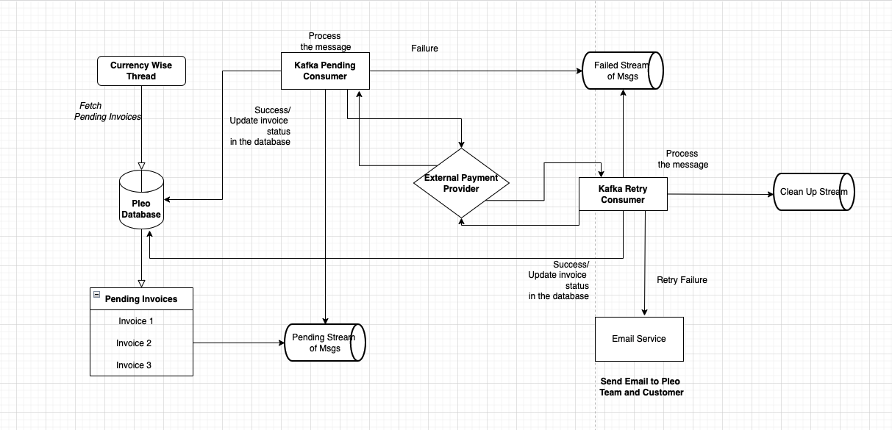
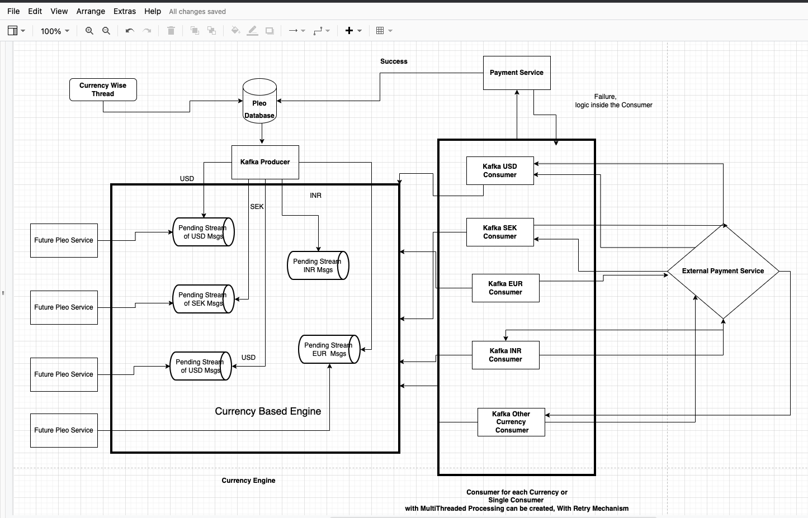

## Antaeus

Antaeus (/ænˈtiːəs/), in Greek mythology, a giant of Libya, the son of the sea god Poseidon and the Earth goddess Gaia. He compelled all strangers who were passing through the country to wrestle with him. Whenever Antaeus touched the Earth (his mother), his strength was renewed, so that even if thrown to the ground, he was invincible. Heracles, in combat with him, discovered the source of his strength and, lifting him up from Earth, crushed him to death.

Welcome to our challenge.

## The challenge

As most "Software as a Service" (SaaS) companies, Pleo needs to charge a subscription fee every month. Our database contains a few invoices for the different markets in which we operate. Your task is to build the logic that will schedule payment of those invoices on the first of the month. While this may seem simple, there is space for some decisions to be taken and you will be expected to justify them.

## Instructions

Fork this repo with your solution. Ideally, we'd like to see your progression through commits, and don't forget to update the README.md to explain your thought process.

Please let us know how long the challenge takes you. We're not looking for how speedy or lengthy you are. It's just really to give us a clearer idea of what you've produced in the time you decided to take. Feel free to go as big or as small as you want.

## Developing

Requirements:
- \>= Java 11 environment

Open the project using your favorite text editor. If you are using IntelliJ, you can open the `build.gradle.kts` file and it is gonna setup the project in the IDE for you.

### Building

```
./gradlew build
```

### Running

There are 2 options for running Anteus. You either need libsqlite3 or docker. Docker is easier but requires some docker knowledge. We do recommend docker though.

*Running Natively*

Native java with sqlite (requires libsqlite3):

If you use homebrew on MacOS `brew install sqlite`.

```
./gradlew run
```

*Running through docker*

Install docker for your platform

```
docker build -t antaeus
docker run antaeus
```

### App Structure
The code given is structured as follows. Feel free however to modify the structure to fit your needs.
```
├── buildSrc
|  | gradle build scripts and project wide dependency declarations
|  └ src/main/kotlin/utils.kt 
|      Dependencies
|
├── pleo-antaeus-app
|       main() & initialization
|
├── pleo-antaeus-core
|       This is probably where you will introduce most of your new code.
|       Pay attention to the PaymentProvider and BillingService class.
|
├── pleo-antaeus-data
|       Module interfacing with the database. Contains the database 
|       models, mappings and access layer.
|
├── pleo-antaeus-models
|       Definition of the Internal and API models used throughout the
|       application.
|
└── pleo-antaeus-rest
        Entry point for HTTP REST API. This is where the routes are defined.
```

### Main Libraries and dependencies
* [Exposed](https://github.com/JetBrains/Exposed) - DSL for type-safe SQL
* [Javalin](https://javalin.io/) - Simple web framework (for REST)
* [kotlin-logging](https://github.com/MicroUtils/kotlin-logging) - Simple logging framework for Kotlin
* [JUnit 5](https://junit.org/junit5/) - Testing framework
* [Mockk](https://mockk.io/) - Mocking library
* [Sqlite3](https://sqlite.org/index.html) - Database storage engine

Happy hacking 😁!

## Existing coded Design :




## High Volume Transaction Proposed Design :




## Developer Thoughts Section
- The initial use case that caught my mind was invoice volumes that we might be fetching from the database
Thinking this into consideration, I have decided on a solution to fetch PENDING invoices based on the currency.
- A thread pool is created with size based on the currency file and pending invoices are retrieved.
- I have given a long thought to decide about the way the external payment implementation i was considering the tradeoff 
between using a REST call and MQ/Apache kafka based system.
- The reason for not using REST for external payment system in this scenario is that, the users are not waiting for a Response immediately
so the thought of sending the Invoices to a Queue / kafka based system made sense.
- At this point we are interested in charging the customer and how we are going to implement the retry mechanism
and how the user/Pleo team is going to be intimated about the success /failure of payment.
- I am thinking of building an Engine based system for the external charging implementation
- ``Curreny Engine`` - This Engine is going to be responsible for handling of payments happening for that particular currency.

